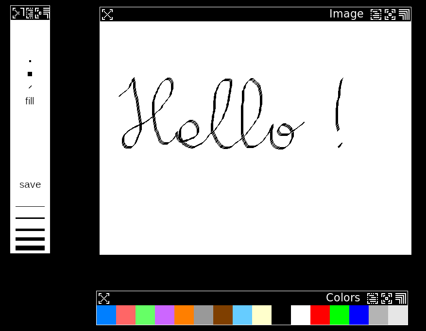

# sdl_simple_paint

This is a simple paint program written in SDL: 

* license

Copyright (c) Thomas Haschka 2019
This software is provided 'as-is', without any express or implied
warranty. In no event will the authors be held liable for any damages
arising from the use of this software. 

Permission is granted to anyone to use this software for any purpose,
including commercial applications, and to alter it and redistribute it
freely, subject to the following restrictions: 

    The origin of this software must not be misrepresented; you must
    not claim that you wrote the original software. If you use this
    software in a product, an acknowledgment in the product
    documentation would be appreciated but is not required. 
	
    Altered source versions must be plainly marked as such, and must
	not be misrepresented as being the original software. 
    This notice may not be removed or altered from any source distribution.


* compilation
You need the sdl2 library and libpng, both in the dev versions installed 
on your system.

On a typical linux / unix system with gcc you may compile this with:
```
gcc -O2 `sdl2-config --libs` `sdl2-config --cflags` sdldraw.c -o sdldraw -lpng
```

* usage 
You then may draw on a png image by calling:
```
./sdldraw your.png
```
hitting the save button might save your image overwriting the previous one.

Calling just:
`./sdldraw` will open a blank 640 by 480 canvas and save to `paintout.png`
Be warned if a previous paintout.png exists it might be overwritten!

For a different canvas you have to specify:
`./sdldraw filename.png sizex sizey`
This will open a canvas of sizex by sizey saving to filename.png if you hit 
the safe button. 

You may also change the collor palette, in order to do so you need create a 
palette file.

A palette file must consist of 16 lines containing 3 seperated integers between
0 and 255 to represent - red, green and blue - like:
```
  0   0   0
255 255 255
124 124 124
...
```
note that you have to specify 16 colors otherwise the default palette will be
loaded.

* screenshot




